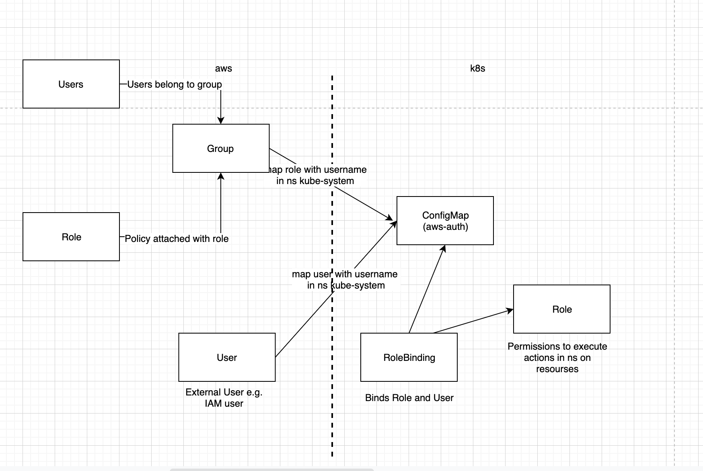

## RBAC (Role Based Access Control)

The core logical components of RBAC are:

__Entity__
A group, user, or service account (an identity representing an application that wants to execute certain operations (actions) and requires permissions to do so).

__Resource__
A pod, service, or secret that the entity wants to access using the certain operations.

__Role__
Used to define rules for the actions the entity can take on various resources.

__Role binding__
This attaches (binds) a role to an entity, stating that the set of rules define the actions permitted by the attached entity on the specified resources.
__There are two types of Roles (Role, ClusterRole) and the respective bindings (RoleBinding, ClusterRoleBinding). These differentiate between authorization in a namespace or cluster-wide__

__Namespace__
Namespaces are an excellent way of creating security boundaries, they also provide a unique scope for object names as the ‘namespace’ name implies. They are intended to be used in multi-tenant environments to create virtual kubernetes clusters on the same physical cluster.

